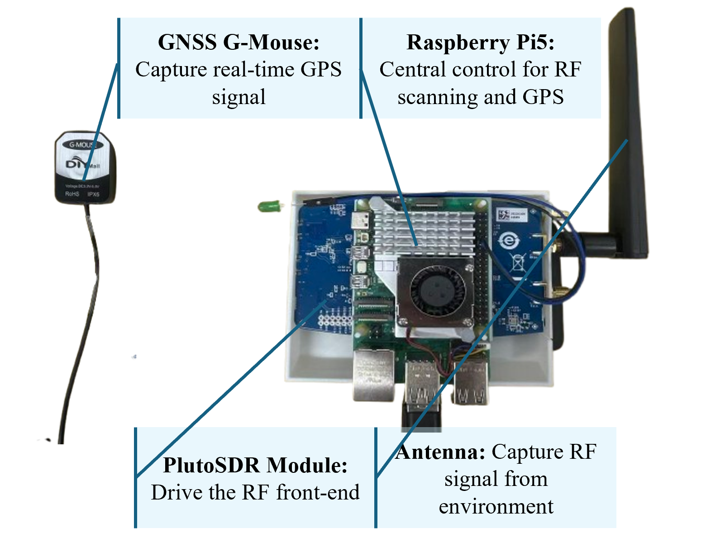
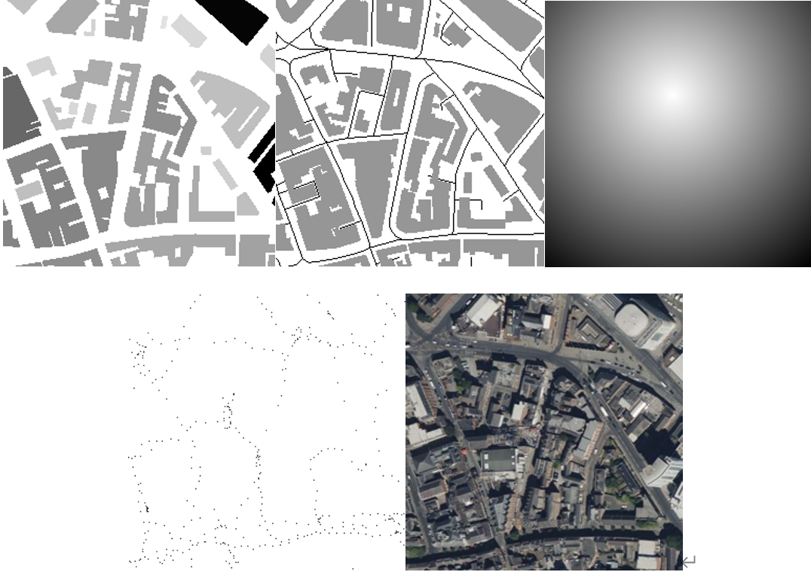
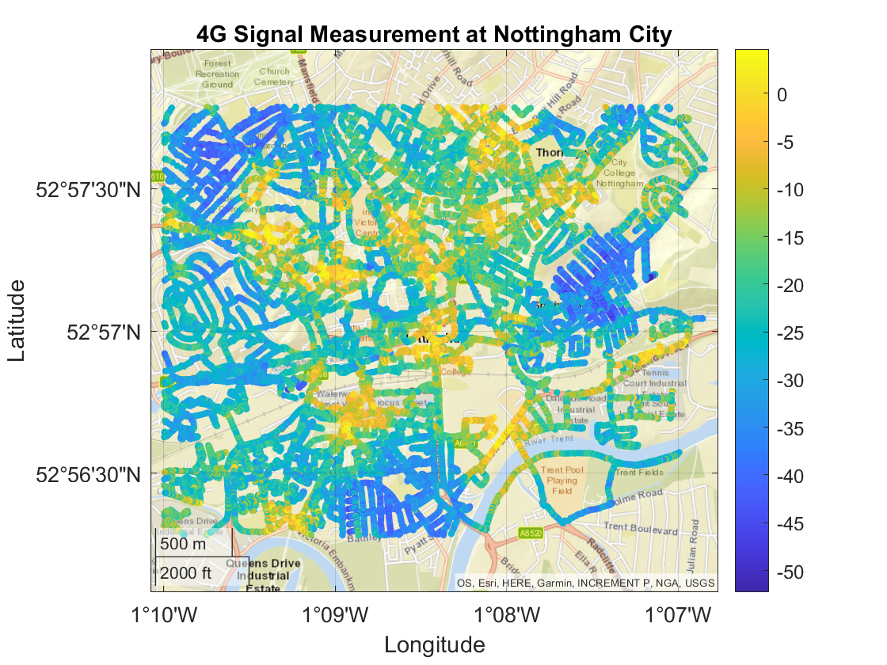

# City-Scale-Multi-model-Channel-Modelling
**Multi-Modal Neural Networks Based Large Geographical Area Radio Mapping**
The Multi-model Channel Modelling for city 4G signal, including the dataset and the model.

## Hardware Setup
The hardware setup integrates a Raspberry Pi as the main controller, an ADALM-Pluto SDR for RF signal acquisition and spectrum scanning, and a USB GPS mouse for real-time positioning and timestamped geolocation logging. With external antennas and a stable power supply, the system supports continuous field measurements and enables synchronized collection of wireless signal strength data and location information for downstream radio map modelling.

The figure below show the physical hardware.
<p align="center">
  
</p>
<p align="center">
  <em><b>Figure 1.</b> The device of the wireless signal scanning.</em>
</p>

## Dataset
The folder structure is described as below(The complete dataset will be released after the paper is published.).
```
${ROOT}
|-- height/                  # Building height maps (numeric matrices, .json)
|   |-- *.json               # 256x256 height matrix (unit: meter). 0 = no building
|
|-- osm/                     # OSM masks (binary images, .jpg)
|   |-- *.jpg                # binary map for roads + buildings (0/255)
|
|-- ref_point/               # Transmitter coverage / reference point masks (binary images, .jpg)
|   |-- *.jpg                # binary map indicating TX tower coverage area (0/255)
|
|-- rssi/                    # Sparse RSSI measurements (numeric matrices, .json)
|   |-- *.json               # 256x256 RSSI matrix (unit: dBm). missing pixels = -1
|
|-- sat/                     # Satellite images (RGB images, .jpg)
|   |-- *.jpg                # 256x256x3 RGB image
```
Data Description：
-Coverage area: Nottingham city centre, approximately 2.5 km × 3.5 km.

-Tile size: each sample corresponds to a 256 m × 256 m region.

-Spatial resolution: 1 m/pixel, therefore each modality is aligned at 256 × 256 pixels. 

The samples of different data. 
<p align="center">
  
</p>
<p align="center">
  <em><b>Figure 2.</b> Multi-modal dataset examples. From top to bottom, and from left to right:</em>
</p>

<p align="center">
  (1) Building height (visualized) &nbsp;&nbsp;
  (2) OSM (roads + buildings) &nbsp;&nbsp;
  (3) TX coverage (ref_point) &nbsp;&nbsp;
  (4) Sparse RSSI measurement (visualized) &nbsp;&nbsp;
  (5) Satellite image
</p>


<p align="center">
  
</p>
<p align="center">
  <em><b>Figure 3.</b> ity scale measured data. </em>
</p>

## Code
The code contains the main multi-modal model.  This model is mainly based on CI propagation path loss model.
``` 
python MARS_model.py
```

The main code for the measurement device.
```
python MARS_model.py
```


